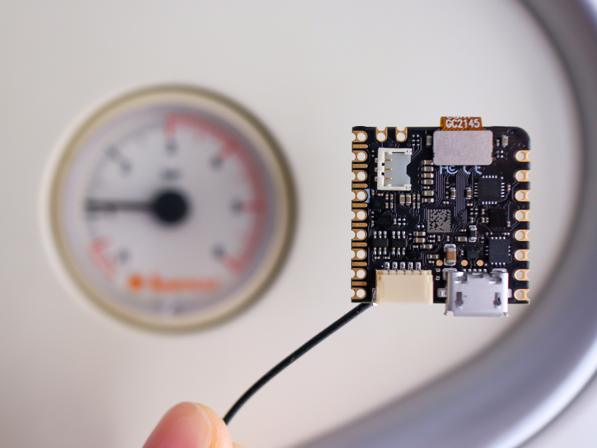


# Analog Meter Reading with Nicla Vision

Vertical | Hardware Target | Manufacturer | Type | Feature used:
----------|-------|-------------|-----------------|-
Smart Building | Nicla Vision|Arduino|Computer Vision|FOMO

## The challenge

Analog gauges are often used in industrial settings to measure pressure, temperature, and flow, among other process parameters. In many cases, analog gauges are preferred over digital ones because most analog gauges mounted on old machinery cannot be easily replaced or it would be too costly to do so. However, they have a number of drawbacks, such as requiring visual inspection by a human operator to visually inspect them and the difficulty of integrating them into digital systems to automate tasks.

## The solution
Nicla Vision is the perfect match for this use case, which features a potent processor able to run machine learning models on the edge, an embedded 2MP color camera, and is simple to integrate with Edge Impulse. It also offers WiFi and Bluetooth Low Energy connectivity so you can send your data to the cloud without having to use another development board.

## Conclusion

The use of analog meter readings is critical for monitoring resource consumption in a variety of settings. One key reason for this is that computer vision techniques can be used to quickly and easily analyze hundreds or even thousands of readings in order to detect patterns and trends for numerous types of data. Additionally, analog meter reading allows for more precision in terms of tracking energy, gas, and water usage, as it provides real-time data that is not subject to the same inaccuracies that can arise with smart meters. This makes analog meter reading an important tool for businesses in their efforts to improve efficiency and reduce costs.

## Find out more
To find a step-by-step guide on how to build this yourself, check out https://docs.edgeimpulse.com/experts/analog-meter-reading-with-nicla-vision
## Authors
   [Zalmotek team](https://zalmotek.com/)

